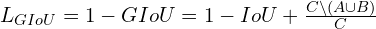

1. IOU loss:

IOU loss = 1 - IOU
Issue of IOU loss is that when no overlap IOU=0 => IOU loss=1, which is constant.
Hence with no change in loss, the gradient will be zero  

2. GIOU loss (Generalized IoU):

IOU=0, loss is not fixed, instead, it depends on how far the prediction and ground truth boxes are. So it is a better loss function compared to IOU.
Because even if IOU=0, it has a gradient to push the bounding box toward the ground truth.

3.DIOU loss (Distance IoU):

DIOU loss converges faster compared to IOU and GIOU

4. CIOU loss (Complete IoU):

